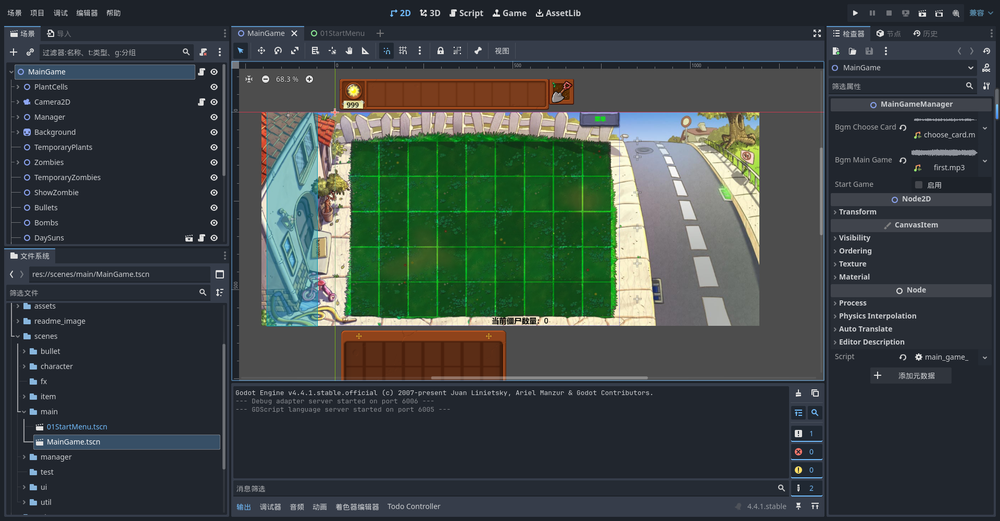
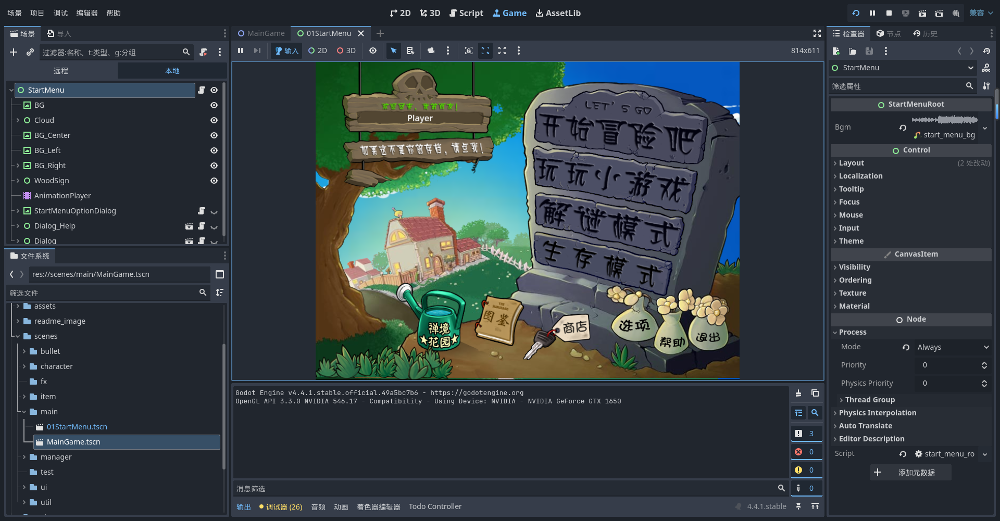

# 🌱 使用godot重置PVZ
当最后一颗西瓜击败僵王博士，玩家体验过各种小游戏与无尽模式后，这款经典游戏依旧让人回味无穷。

从95版、植物娘、胆小菇之梦，到杂交版、融合版等众多精彩的改版与同人作品，相信许多玩家都曾萌生过属于自己的创意与幻想。

本项目基于 [Godot4.4](https://godotengine.org/zh-cn/) 引擎，致力于对原版《植物大战僵尸》进行高质量复刻（完美还原），目前已实现前院白天场景中所有植物与僵尸的完整功能。

欢迎各位大佬在本开源项目基础上，完成属于自己的 PVZ 同人改版之梦！
## 项目展示
### 项目视频介绍
[开源！使用Godot实现对原版PVZ的完美复刻 (https://www.bilibili.com/video/BV1FKNJzUEpp/)](https://www.bilibili.com/video/BV1FKNJzUEpp/)  
请观看该合集最新的展示视频
### 主游戏界面

### 开始菜单界面

### 游戏运行GIF动图
(gif的帧率比较低，实际运行很流畅)

## 游戏开发相关
### 植物僵尸动画
使用[R2Ga_PVZ](#r2ga_pvz)将植物大战僵尸的动画文件转换为Godot游戏引擎所支持的动画格式。

僵尸动画：使用插件[anim_delet_track](#anim_delet_track)将不需要的的轨道删除，主要是删除删除僵尸胳膊和头相关的visible轨道，僵尸掉手或掉头时使用代码控制visible。

植物动画：植物射击时眨眼和idle时眨眼节点不同，由于射击时眨眼动画需要使用visible轨道，使用插件[anim_player_refactor](#anim_player_refactor)将idle时的眨眼节点visible轨道删除，使用代码控制植物眨眼。

### 子弹攻击碎片溅射
- 创建GPUParticles2D
- texture(GPUParticles2D) 添加子弹碎片图集
- material(CnavasItem) 添加CanvasItemMaterial
	- 修改对应的articles_anim_h_frames和particles_anim_v_frames
- process_material(GPUParticles2D) 添加ParticleProcessMaterial
	- 修改Display-Animation-Offset
- 修改粒子特效相关属性（初始方向，重力加速度，时间缩放）

### 插件
#### [anim_player_refactor](https://github.com/poohcom1/godot-animation-player-refactor)  
一个 Godot 插件，用于重构 AnimationPlayer 的动画。
[插件使用教程](https://www.bilibili.com/video/BV1GxXWYZExH?spm_id_from=333.788.videopod.sections&vd_source=1005534986b111b7c1911fe1c36ac835)

注意：目录下**plugin.gd**脚本中调用的函数EditorUtil.find_animation_menu_button(base_control)只支持英文，需要进入函数修改对应的代码 func(node): return node.text == "Animation" 修改为 func(node): return node.text == "Animation" or node.text == "动画" 

### [R2Ga_PVZ](https://github.com/hsk-dream/PVZ_reanim2godot_animation)
将植物大战僵尸的动画文件转换为Godot游戏引擎所支持的动画格式。[使用教程](https://www.bilibili.com/video/BV1XBKwzdELA/)  
forked from [PVZ_reanim2godot_animation](https://github.com/HYTommm/PVZ_reanim2godot_animation)

### [anim_delet_track](https://github.com/hsk-dream/anim_delet_track)
Godot插件，一键删除目录下所有动画资源文件的被选择轨道。 [使用教程](https://www.bilibili.com/video/BV1XBKwzdELA/)  

### PVZ相关参考资料
- [［PVZ解包］一代PVZ植物大战僵尸PAK文件解包教程(https://www.bilibili.com/video/BV1JQ4y1k7KS/)](https://www.bilibili.com/video/BV1JQ4y1k7KS/)

- [Godot4.3——植物大战僵尸：游戏制作教程（已完结） (https://www.bilibili.com/video/BV1AdBtY9Ec5/)](https://www.bilibili.com/video/BV1AdBtY9Ec5/)

- [R2Ga转换器v3.1发布！ (https://www.bilibili.com/video/BV1s3ZbY3E9L/)](https://www.bilibili.com/video/BV1s3ZbY3E9L/)

- [出怪机制 (https://wiki.pvz1.com/doku.php?id=%E6%8A%80%E6%9C%AF:%E5%87%BA%E6%80%AA%E6%9C%BA%E5%88%B6)](https://wiki.pvz1.com/doku.php?id=%E6%8A%80%E6%9C%AF:%E5%87%BA%E6%80%AA%E6%9C%BA%E5%88%B6)

- [pvz的基础知识 (https://zhuanlan.zhihu.com/p/45170276)](https://zhuanlan.zhihu.com/p/45170276)

## 📄 开源协议说明
尊重PVZ原版版权，禁止商用。

本项目为个人学习用途的《植物大战僵尸》重置作品，仅供学习与研究使用。  
原作《植物大战僵尸》的游戏名称、角色、音乐、图像及相关内容的版权归 **PopCap Games** 及其母公司 **Electronic Arts（EA）** 所有。

**本项目完全免费，禁止任何形式的商业化发布与传播**。

本项目所包含的 **源代码部分为原创**，并基于 [MIT 开源许可证](./LICENSE) 发布，允许他人自由使用、修改和再分发。但请注意：

- 请勿将本项目用于任何商业用途；
- 若版权方提出异议，我们将无条件配合下架相关内容。

本项目仅用于学习目的，**禁止商业部署**。

## 🙌 致谢
致敬《植物大战僵尸》原作团队（PopCap & EA）
